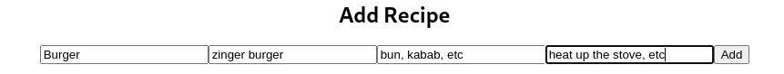

# Final-Exam-Ead

**Server.js Code**

constexpress=require('express');

constpath=require('path');

constmongoose=require('mongoose');

constbodyParser=require('body-parser');

constcors=require('cors');

constport=process.env.PORT || 5000;

constapp=express();

app.use(bodyParser.json());

app.use(cors());

app.use(bodyParser.urlencoded({extended:false}));

app.use(express.json());

mongoose

  .connect("mongodb://127.0.0.1:27017/Final-Exam", {

useNewUrlParser:true,

useUnifiedTopology:true,

  })

  .then(() => {

console.log("Connected to DB");

  })

  .catch((err) => {

console.log(err);

  });

//require recipe

constrecipe=require('./models/recipe');

//crud oprations for the recipe

//get all recipes

app.get('/showRecipes',(req,res)=>{

recipe.find().then(recipes=>{

res.json(recipes);

    }).catch(err=>res.status(404).json({success:false}));

}

);

app.post('/addRecipe',(req,res)=>{

constnewRecipe=newrecipe({

title:req.body.title,

ingredients:req.body.ingredients,

instructions:req.body.instructions,

description:req.body.description,

    });

newRecipe.save().then(recipe=>res.json(recipe));

}

);

app.put('/updateRecipe/:id',(req,res)=>{

recipe.findByIdAndUpdate(req.params.id,req.body).then(recipe=>{

res.json(recipe);

    }).catch(err=>res.status(404).json({success:false}));

}

);

app.delete('/deleteRecipe/:id',(req,res)=>{

recipe.findByIdAndDelete(req.params.id).then(recipe=>res.json(recipe)).catch(err=>res.status(404).json({success:false}));

}

);

app.listen(port,()=>{

console.log(`Server is running on port ${port}`);

  }

    );

**Database Schema Model**

const { default: mongoose} = require('mongoose');

constmoongoose = require('mongoose');

constschema= moongoose.Schema;

constrecipeSchema =newschema({

title:{type:String,required:true},

ingredients:{type:String,required:true},

instructions:{type:String,required:true},

description:{type:String,required:true},

});

module.exports = mongoose.model('Recipe', recipeSchema);

**App.js Code** 

import'./App.css';

import { useState } from'react';

import { useEffect } from'react';

importAddRecipefrom'./AddRecipe';

functionApp() {

const [title, settitle] = useState("")

const [description, setdescription] = useState("")

const [ingredients, setingredients] = useState("")

const [instructions, setinstructions] = useState("")

const [newrecipe, setnewrecipe] = useState("")

constaddRecipe = () => {

fetch("http://localhost:5000/addRecipe", {

method:"POST",

headers: {

"Content-Type":"application/json",

    },

body:JSON.stringify({

title,

description,

ingredients,

instructions,

    }),

    })

    .then((res) =>res.json())

    .then((data) => {

setnewrecipe(data);

    });

  };

constupdateRecipe = (id) => {

fetch(`http://localhost:5000/updateRecipe/${id}`, {

method:"PUT",

headers: {

"Content-Type":"application/json",

    },

body:JSON.stringify({

title,

description,

ingredients,

instructions,

    }),

    })

    .then((res) =>res.json())

    .then((data) => {

setnewrecipe(data);

    });

  };

constdeleteRecipe = (id) => {

fetch(`http://localhost:5000/deleteRecipe/${id}`, {

method:"DELETE",

    })

    .then((res) =>res.json())

    .then((data) => {

setnewrecipe(data);

    });

  };

const [recipe, setrecipe] = useState("")

useEffect(() => {

fetch("http://localhost:5000/showRecipes")

  .then(res=>res.json())

  .then(data=>setrecipe(data))

}, [])

return (

<>

<divclassName="App">

<h1>Recipes</h1>

<divclassName="recipes">

{recipe && recipe.map((recipe) => (

<divclassName="recipe"key={recipe._id}>

<h2>{recipe.title}</h2>

<h3>{recipe.description}</h3>

{recipe.ingredients}

{recipe.instructions}

<buttononClick={() => {{

{recipe.ingredients}
}

{recipe.instructions}

    }

}>View`</button>`

    ))}

<divclassName="addRecipe">

<h2>Add Recipe</h2>

<input

type="text"

placeholder="title"

onChange={(e) =>settitle(e.target.value)}

/>

<input

type="text"

placeholder="description"

onChange={(e) =>setdescription(e.target.value)}

/>

<input

type="text"

placeholder="ingredients"

onChange={(e) =>setingredients(e.target.value)}

/>

<input

type="text"

placeholder="instructions"

onChange={(e) =>setinstructions(e.target.value)}

/>

<buttononClick={addRecipe}>Add`</button>`

<divclassName="updateRecipe">

<h2>Update Recipe</h2>

<input

type="text"

placeholder="title"

onChange={(e) =>settitle(e.target.value)}

/>

<input

type="text"

placeholder="description"

onChange={(e) =>setdescription(e.target.value)}

/>

<input

type="text"

placeholder="ingredients"

onChange={(e) =>setingredients(e.target.value)}

/>

<input

type="text"

placeholder="instructions"

onChange={(e) =>setinstructions(e.target.value)}

/>

<buttononClick={updateRecipe}>Update`</button>`

<divclassName="deleteRecipe">

<h2>Delete Recipe</h2>

<buttononClick={deleteRecipe}>Delete`</button>`

</>

  );

}

exportdefaultApp;

**Output Screenshots:**

Show Recipies:

Add and Update and delete output:

Specific example:

Rest API for testing:

GET http://localhost:5000/showRecipes

POST http://localhost:5000/addRecipe

Content-Type:application/json

{

"title": "Chicken Parm",

"ingredients": "Chicken, Parmesan, Tomato Sauce",

"instructions": "Cook the chicken, add the sauce, add the cheese, bake",

"description": "A classic Italian dish"

}
